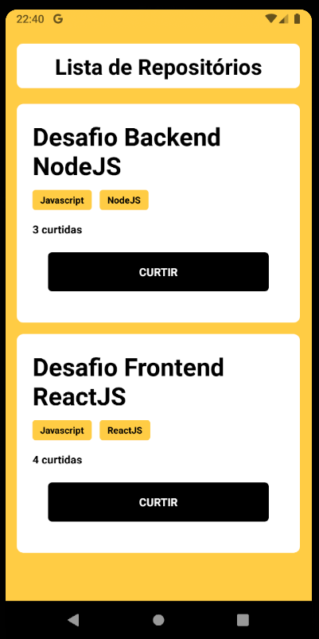

# Bootcamp GoStack
###### Aluno: Guilherme Medeiros Laureano
## Desafio 04: Conceitos do React Native

Nesse desafio, foi desenvolvido uma aplicação para fixar os conhecimentos em React Native aprendidos no Bootcamp GoStack Rocketseat - Nível 01. 

O desenvolvimento se deu a partir de um [template](https://github.com/Rocketseat/gostack-template-conceitos-react-native) disponibilizado pela Rocketseat.

### Sobre a aplicação
Essa é uma aplicação que apresenta os repositórios armazenados e permite adicionar curtidas aos repositórios na API. 

A aplicação da continuedade ao desenvolvendo da aplicação para armazenar repositórios, que foi desenvolvido o [backend](https://github.com/guilhermelaureano/desafioBackendNodeJS) utilizando o Node.js e a parte web no desafio [frontend](https://github.com/guilhermelaureano/desafioFrontendReactJS).

### Funcionalidades

- Listar os repositórios da API: apresenta uma lista com o campo title de todos os repositórios que estão cadastrados na API, as techs relacionadas, o número de curtidas e o botão para curtir.

